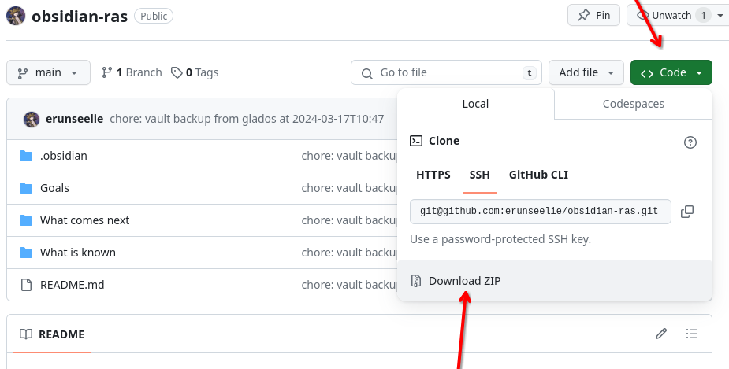
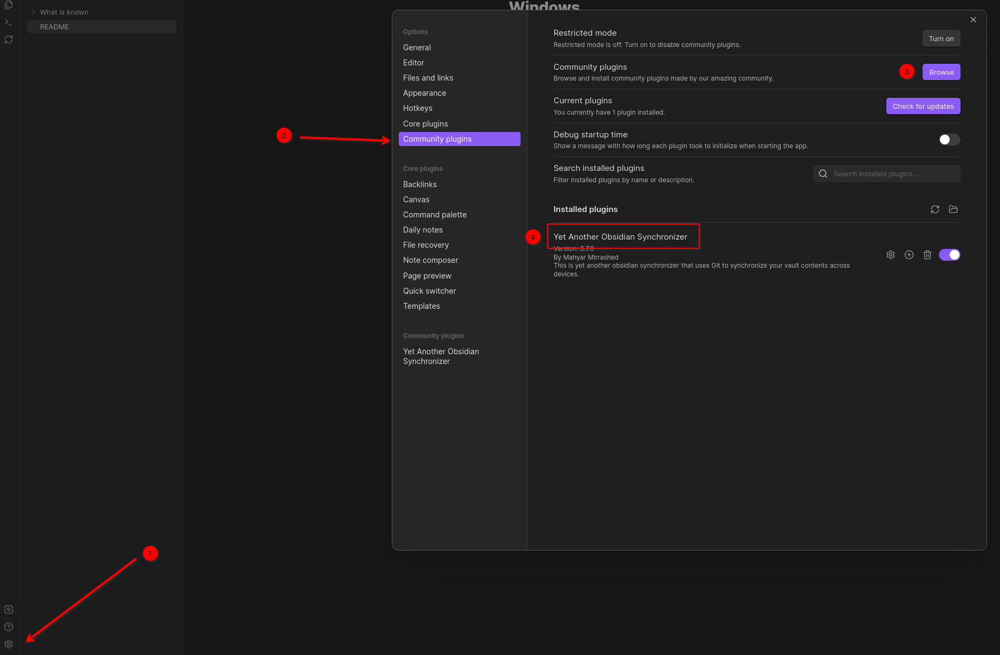
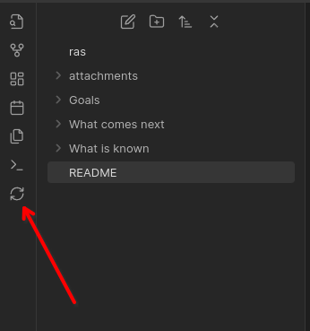

# Windows
1. Type `git version` to check whether git is already installed.
2. If not, [download git](https://github.com/git-for-windows/git/releases/download/v2.44.0.windows.1/Git-2.44.0-64-bit.exe) and run it.
3. Repeat step 1 to confirm installation.

# Mac
1. Follow steps [here](https://git-scm.com/download/mac).
2. Type `git version` to confirm installation.

# Finishing Up
1. Go to [my repository](https://github.com/erunseelie/obsidian-ras), click Code, and Download Zip. Place this somewhere on your computer.

2. Open Obsidian's settings (1), go to Community Plugins (2) and enable community plugins, Browse (3) and search for "Yet Another Obsidian Synchronizer" (4).

3. Try clicking the new sync button at the left menu bar in Obsidian. If nothing appears to work, try using a command terminal to run `git push` in the root directory of the Obsidian vault, and report any issues.

